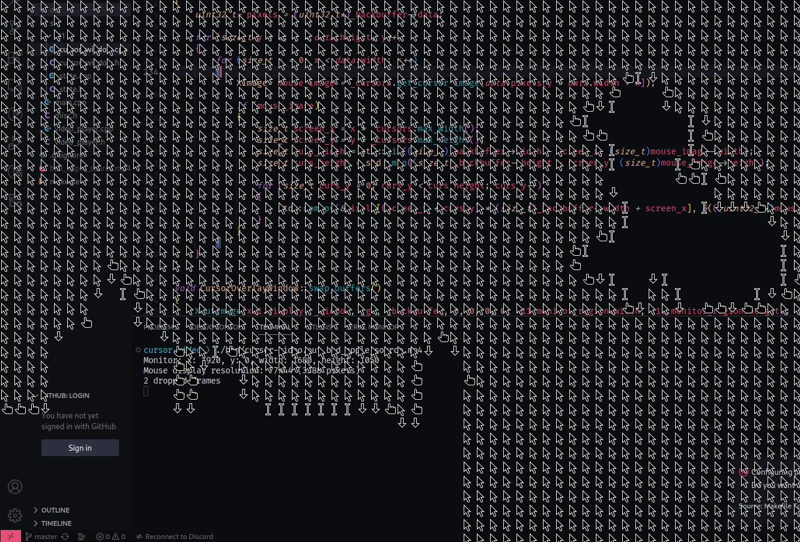

# Cursor Video player
Uses cursors to paint a video to the screen

It can play Bad Apple: [https://www.youtube.com/watch?v=HCm1XcKEeF8](https://www.youtube.com/watch?v=HCm1XcKEeF8)

Currently only works on systems the X11 windowing system. Make sure to have X11 dev dependencies and ffmpeg to compile.
